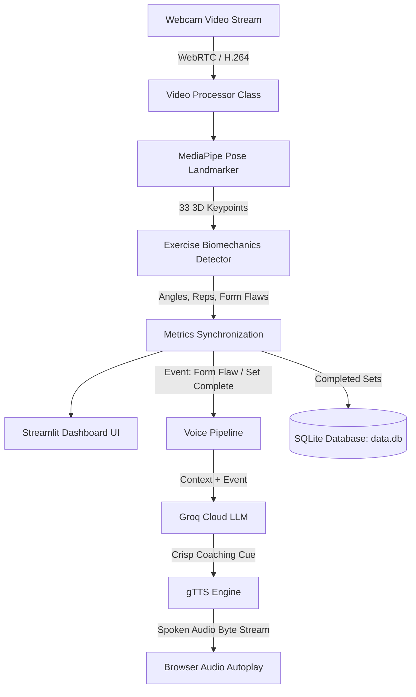

# VisionFit 🏋️‍♂️ — Real-Time AI Gym Coach & Form Corrector

[](https://streamlit.io/)
[](https://www.python.org/)
[](https://developers.google.com/mediapipe)
[](https://opencv.org/)
[](https://groq.com/)
[](https://www.docker.com/)

> **Your form. Analyzed. Corrected. In milliseconds.**  
> VisionFit is an intelligent real-time personal fitness coach that uses computer vision to track body landmarks, validate biomechanical angles, count repetitions, and provide **instant proactive voice coaching cues** powered by Groq and AI Text-to-Speech.

---

## 🌟 Key Features

- **🎥 Real-Time WebRTC Computer Vision**: Ultra-low latency camera streaming using `streamlit-webrtc` and Google MediaPipe Pose Landmark Detection.
- **🏋️ Multi-Exercise Biomechanics**:
  - **Squats**: Knee angle tracking, back angle evaluation, depth validation (*"TOO HIGH"*, *"GOOD DEPTH"*).
  - **Push-ups**: Elbow flexion angles, spine & hip alignment (*"SAGGING"*, *"PIKED UP"*).
  - **Biceps Curls**: Arm range-of-motion, elbow drift detection, torso swing prevention.
  - **Shoulder Press**: Overhead extension check, lower-back arch monitoring.
  - **Lunges**: Front knee flexion, torso posture, and balance stability checks.
- **🤖 Proactive AI Voice Coaching (Groq)**:
  - Generates crisp, high-energy coaching cues (10–15 words) tailored to real-time form flaws.
  - Powered by Groq's high-speed inference engine (`openai/gpt-oss-20b` / `groq/compound-mini`) with hidden reasoning mode for sub-second responses.
- **🗣️ Audio Voice Feedback (TTS)**: Converts coach cues to spoken audio that plays automatically during your workout.
- **📈 Rep Counting & Progress Tracking**: Automatic repetition counting per set, target sets tracking, and rest cues.
- **📊 Daily Workout History**: Persistent session logs tracking exercise type, total reps, sets, and active duration.
- **🌐 Standalone Showcase Landing Page**: Includes a sleek dark-themed HTML/CSS landing page for marketing and user onboarding.

---

## 🏗️ System Architecture



---

## 📁 Repository Structure

```text
VisionFit-/
├── Dockerfile                  # Production container definition (Python 3.12-slim)
├── .dockerignore               # Docker ignore rules
├── .gitignore                  # Git exclusions (protects .env & secrets.toml)
├── .env.example                # Environment variable reference template
├── packages.txt                # Linux apt-get packages for Streamlit Cloud (libgl1)
├── requirements.txt            # Python dependencies (Streamlit, OpenCV, MediaPipe, Groq)
├── README.md                   # Project documentation
│
├── LandingPage/                # Showcase Landing Page
│   ├── index.html              # Modern dark-mode landing page
│   ├── style.css               # Landing page styling & animations
│   ├── fonts/                  # Custom web fonts
│   ├── IMGs_add_your_own/      # Product screenshot gallery assets
│   └── videos_add_your_own/    # Demo video clips
│
└── app/                        # Core Streamlit Application
    ├── main.py                 # Streamlit entry point
    ├── requirements.txt        # Sub-directory dependencies
    ├── packages.txt            # System dependencies
    ├── core/                   # Mathematical calculations & angle geometry
    ├── detectors/              # Per-exercise angle detectors (squat, pushup, etc.)
    ├── ml_models/              # MediaPipe Pose Landmarker task model
    ├── services/
    │   ├── auth/               # User session & login wall
    │   ├── coaching/           # LLMCoach (Groq) & TTS voice pipeline
    │   ├── config/             # Workout parameters & system prompts
    │   ├── persistence/        # SQLite exercise repository
    │   ├── tracking/           # Metric sync & rep tracking logic
    │   ├── ui/                 # Styling loaders & WebRTC styling injectors
    │   └── vision/             # WebRTC video frame processing pipeline
    └── static/                 # Stylesheet & custom fonts
```

---

## 🚀 Quick Start (Local Setup)

### 1. Prerequisites
- **Python 3.12** is recommended (MediaPipe binary wheels support Python 3.12).
- Webcam connected.
- A free [Groq API Key](https://console.groq.com/keys).

### 2. Clone the Repository
```bash
git clone https://github.com/SAHIL-AGARWAL-IN/VisionFit-.git
cd VisionFit-
```

### 3. Set Up a Virtual Environment
```bash
# Windows
py -3.12 -m venv venv
.\venv\Scripts\activate

# Linux / macOS
python3.12 -m venv venv
source venv/bin/activate
```

### 4. Install Dependencies
```bash
pip install -r requirements.txt
```

### 5. Configure API Keys
Create a `.env` file in the root directory (or copy `.env.example`):
```bash
cp .env.example .env
```
Edit `.env` with your Groq API key:
```env
GROQ_API_KEY=gsk_your_groq_api_key_here
```

### 6. Run the Application
```bash
streamlit run app/main.py
```
The app will automatically launch at **`http://localhost:8501`**.

---

## ☁️ Deployment Guide

### Method 1: Streamlit Community Cloud *(Free & Recommended)*

1. Push your repository to GitHub.
2. Go to [share.streamlit.io](https://share.streamlit.io) and log in with GitHub.
3. Click **"New app"** and configure:
   - **Repository:** `SAHIL-AGARWAL-IN/VisionFit-`
   - **Branch:** `main`
   - **Main file path:** `app/main.py`
4. Expand **Advanced settings** ➔ **Secrets**, and paste:
   ```toml
   GROQ_API_KEY = "your_groq_api_key_here"
   ```
5. *(Optional WebRTC TURN config for strict firewalls):*
   ```toml
   [rtc_configuration]
   iceServers = [
     { urls = ["stun:stun.l.google.com:19302", "stun:stun1.l.google.com:19302"] }
   ]
   ```
6. Click **Deploy!**

---

### Method 2: Docker Container (Render, Railway, AWS, DigitalOcean)

A production-ready [Dockerfile](Dockerfile) is included:

1. **Build Docker Image:**
   ```bash
   docker build -t visionfit .
   ```

2. **Run Container:**
   ```bash
   docker run -d \
     -p 8501:8501 \
     -e GROQ_API_KEY="your_groq_api_key_here" \
     --name visionfit-app \
     visionfit
   ```

3. Open `http://localhost:8501`.

---

## ⚙️ Environment Variables & Configuration

| Variable | Required | Default | Description |
| :--- | :---: | :--- | :--- |
| `GROQ_API_KEY` | **Yes** | `None` | API key from [Groq Console](https://console.groq.com/keys). |
| `GROQ_MODEL` | No | `openai/gpt-oss-20b` | Groq model for cues (`openai/gpt-oss-20b`, `groq/compound-mini`). |
| `STREAMLIT_SERVER_PORT` | No | `8501` | Port to bind the server to. |

---

## 🔒 Security Best Practices

- Real `.env` files and `.streamlit/secrets.toml` are strictly ignored in `.gitignore` to prevent credential exposure.
- Never commit private API keys to GitHub. Always use environment variables or platform secret managers.

---

## 📄 License

Distributed under the MIT License. See `LICENSE` for more information.